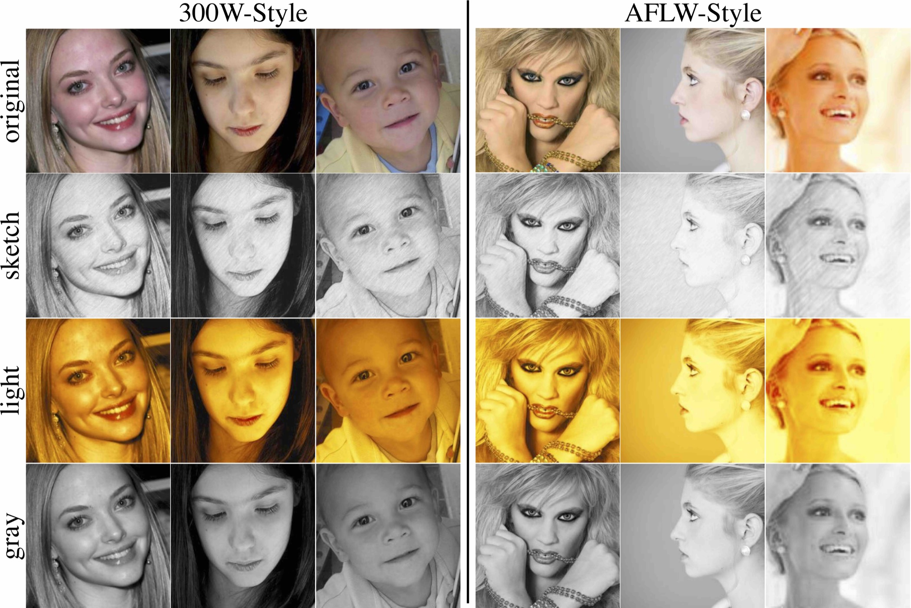

# [Style Aggregated Network for Facial Landmark Detection](http://openaccess.thecvf.com/content_cvpr_2018/html/Dong_Style_Aggregated_Network_CVPR_2018_paper.html)

We provide the training and testing codes for [SAN](https://d-x-y.github.io/publication/style-aggregation-network), implemented in [PyTorch](pytorch.org).
This project is inspired by [supervision-by-registration](https://github.com/facebookresearch/supervision-by-registration).

## Preparation

### Dependencies
- [Python3.6](https://www.anaconda.com/download/#linux)
- [PyTorch=0.4](http://pytorch.org/)
- [torchvision](http://pytorch.org/docs/master/torchvision)

### Datasets Download
- Download 300W-Style and AFLW-Style from [Google Drive](https://drive.google.com/open?id=14f2lcJVF6E4kIICd8icUs8UuF3J0Mutd) or [Baidu Yun](https://pan.baidu.com/s/1ZMT321lgl2Em8WR3IMjkNw#list/path=%2F), and extract the downloaded files into `~/datasets/`. Since the tgz files for 300W-Style and AFLW-Style are too large to download, I split them into several small parts in the [`300W-Style-Splits`](https://drive.google.com/open?id=1SXAon0mw040C-nvOd4VFN9RO-t19dX5Y) folder and the [`AFLW-Style-Splits`](https://drive.google.com/open?id=12EtnJPpH7VFRmfEwMKamzurTHaK0j8aJ) folder on Google Drive. You can download all parts and use `cat 300W-Style.tgz.parta* > 300W-Style.tgz` and `cat AFLW-Style.tgz.parta* > AFLW-Style.tgz` to get the original tgz file.
- In 300W-Style and AFLW-Style directories, the `Original` sub-directory contains the original images from [300-W](https://ibug.doc.ic.ac.uk/resources/300-W/) and [AFLW](https://www.tugraz.at/institute/icg/research/team-bischof/lrs/downloads/aflw/)
- The sketch, light, and gray style images are used to analyze the image style variance in facial landmark detection.
- For simplification, we change some file names, such as removing the space or unifying the file extension.

In `cluster.py`, we use ResNet-152 to classify the 4 style class of 300W-Style and AFLW-Style, it obtains 93.5% accuracy (training on 300W-Style and evaluating on AFLW-Style), and 96.6% accuracy (training on AFLW-Style and evaluating on 300W-Style).

If you can't download the datasets via the above link, please try:
```
300W-Style : https://drive.google.com/open?id=1wy9ZUSWE4V2WdMbXS3Jkq7kQEYHSpLk1
AFLW-Style : https://drive.google.com/open?id=1y5JrOd86NGHTPZLYLgeqRJzT2T4ACWJe
```


Figure 1. Our 300W-Style and AFLW-Style datasets. There are four styles, original, sketch, light, and gray.


##### 300W-Style Directory
`300W-Style.tgz` should be extracted into `~/datasets/300W-Style` by typing `tar xzvf 300W-Style.tgz; mv 300W-Convert 300W-Style`.
It has the following structure:
```
--300W-Gray
 --300W ;  afw  ; helen ; ibug ; lfpw
--300W-Light
 --300W ;  afw  ; helen ; ibug ; lfpw
--300W-Sketch
 --300W ;  afw  ; helen ; ibug ; lfpw
--300W-Original
 --300W ;  afw  ; helen ; ibug ; lfpw
--Bounding_Boxes
 --*.mat
```

##### AFLW-Style Directory
`AFLW-Style.tgz` should be extracted into `~/datasets/AFLW-Style` by typing `tar xzvf AFLW-Style.tgz; mv AFLW-Convert AFLW-Style`.
It has the following structure (`annotation` is generated by `python aflw_from_mat.py`):
```
--aflw-Gray
  --0 2 3
--aflw-Light
  --0 2 3
--aflw-Sketch
  --0 2 3
--aflw-Original
  --0 2 3
--annotation
  --0 2 3
```


### Generate lists for training and evaluation
```
cd cache_data
python aflw_from_mat.py
python generate_300W.py
```
The generated list file will be saved into `./cache_data/lists/300W` and `./cache_data/lists/AFLW`.

### Prepare images for training the style-aggregated face generation module
```
python crop_pic.py
```
The above commands will pre-crop the face images, and save them into `./cache_data/cache/300W` and `./cache_data/cache/AFLW`.


## Training and Evaluation

### 300-W
- Step-1 : cluster images into different groups. For example, running `bash scripts/300W/300W_Cluster.sh 0,1 GTB 3` will generate three file lists into `snapshots/CLUSTER-300W_GTB-3`.
- Step-2 : use `bash scripts/300W/300W_CYCLE_128.sh 0,1 GTB` or `bash scripts/300W/300W_CYCLE_128.sh 0,1 DET` to train SAN on 300-W.
- `GTB` means using the ground truth face bounding box, and `DET` means using the face detection results from a pre-trained detector (these results are provided from the official 300-W website).

### AFLW
- Step-1 : cluster images into different groups, for example `bash scripts/AFLW/AFLW_Cluster.sh 0,1 GTB 3`.
- Step-2 : use `bash scripts/AFLW/AFLW_CYCLE_128.FULL.sh` or `bash scripts/AFLW/AFLW_CYCLE_128.FRONT.sh` to train SAN on AFLW.


### Evaluation on the Single Image

You can donwload a pre-trained model from the `snapshots` directory in [Google-Drive](https://drive.google.com/open?id=14f2lcJVF6E4kIICd8icUs8UuF3J0Mutd) or [Baidu-Pan(extract-code=gcnc)](https://pan.baidu.com/s/1WhScOXeW7A7vqtOKgXvD4Q), which is trained on 300-W. Put it in `snapshots` and use the following command to evaluate a single image. This command will print the location of each landmark and also save the visualization result in `temp_1.png`.
```
CUDA_VISIBLE_DEVICES=1 python san_eval.py --image ./cache_data/cache/test_1.jpg --model ./snapshots/SAN_300W_GTB_itn_cpm_3_50_sigma4_128x128x8/checkpoint_49.pth.tar --face 819.27 432.15 971.70 575.87 --save_path temp_1.png
```
Evaluating on the CPU.
```
python san_eval.py --image ./cache_data/cache/test_1.jpg --model ./snapshots/SAN_300W_GTB_itn_cpm_3_50_sigma4_128x128x8/checkpoint_49.pth.tar --face 819.27 432.15 971.70 575.87 --save_path temp_1.png --cpu
```
The parameter `image` is the image path to be evaluated, `model` is the trained SAN model, and `face` denotes the coordinates of the face bounding box.
The ground truth landmark annotation for `./cache_data/cache/test_1.jpg` is `./cache_data/cache/test_1.pts`.

### Evaluate on 300-W or AFLW
Download the pre-trained model from the `snapshots` directory of [here](https://drive.google.com/open?id=14f2lcJVF6E4kIICd8icUs8UuF3J0Mutd), which is trained on 300-W. Put it in `snapshots` and use the following command to evaluate on 300-W.
```
bash scripts/300W/300W-EVAL.sh 0,1
bash scripts/AFLW/AFLW_CYCLE_128.FULL-EVAL.sh 0,1
```


### Normalization


Figure 2. We use the distance between the outer corners of the eyes, i.e., the 37-th and the 46-th points, for normalization.


## Correction
In the Table 1 of [the paper](http://openaccess.thecvf.com/content_cvpr_2018/papers/Dong_Style_Aggregated_Network_CVPR_2018_paper.pdf), SDM / ESR / LBF / CFSS use the inter-pupil distance for normalization, but we use the inter-ocular distance. If they also use the inter-ocular distance, they can obtain a smaller NME.

## Citation
If this project helps your research, please cite the following papers:
```
@inproceedings{dong2018san,
   title={Style Aggregated Network for Facial Landmark Detection},
   author={Dong, Xuanyi and Yan, Yan and Ouyang, Wanli and Yang, Yi},
   booktitle={Proceedings of the IEEE Conference on Computer Vision and Pattern Recognition (CVPR)},
   pages={379--388},
   doi={10.1109/CVPR.2018.00047},
   year={2018}
}
```

## Contact
To ask questions or report issues, please open an issue on the [issues tracker](https://github.com/D-X-Y/landmark-detection/issues).
